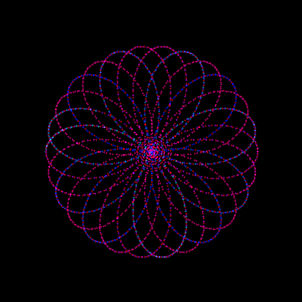
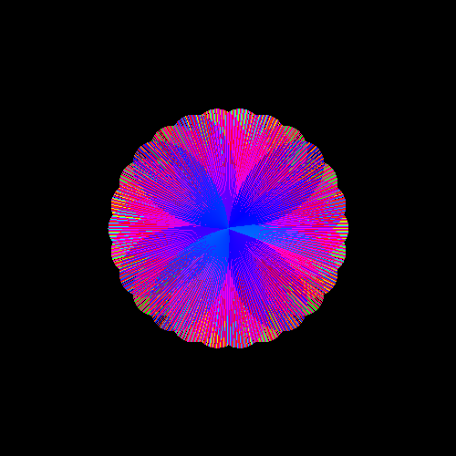
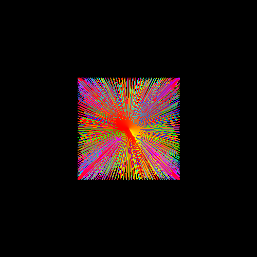

# PolarPlotter

- Plots defined polar functions with customizable speeds
- Added rainbow color function by cycling through HSB hue values
- Option to write to a png file
- EDT implemented

Lissajous Figure:

Sample images:
- Hypotrochoid (dots)

- Hypotrochoid (ines)

- Lissajous Figure (lines)

